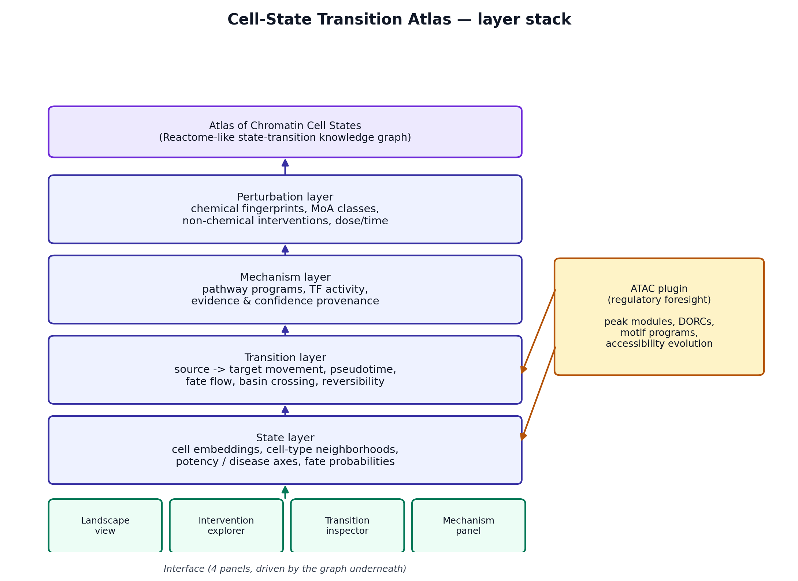
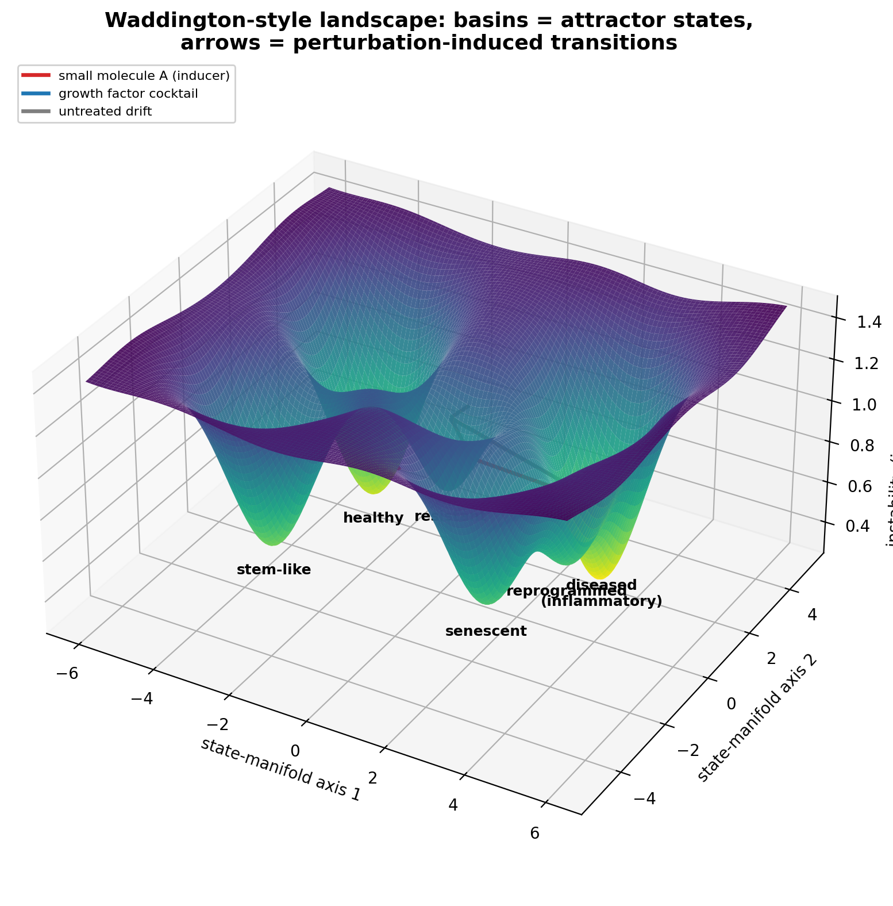

# Cell-State Transition Atlas — front-end prototype

A single-file, static front-end mockup for a **Reactome-style web atlas of cell-state
transitions** — built around a dermal-fibroblast fibrosis / reprogramming model, with
a searchable state map, an intervention layer (compounds, growth factors, physical
stimuli), a chromatin-accessibility (ATAC) isotherm view, and mockup panels for
future epigenetic layers (histone acetylation, DNA methylation).

> **We are building a web atlas for navigable cell-state transitions, with an
> underlying predictive engine that links cellular trajectories to drugs,
> regulatory programs, and multimodal perturbation signals.**

No backend, no build step — `index.html` is the whole app. All data in it is
mocked/illustrative; the point of this repo is the **interaction pattern and
architecture**, not a trained model.

---

## Contents

- [Concept](#concept)
- [Architecture](#architecture)
- [The Waddington-style landscape](#the-waddington-style-landscape)
- [Front-end module map](#front-end-module-map)
- [Data model](#data-model)
- [Run it locally](#run-it-locally)
- [Deploy to GitHub Pages](#deploy-to-github-pages)
- [Adding images to this README](#adding-images-to-this-readme)
- [Roadmap / known limitations](#roadmap--known-limitations)

---

## Concept

Cells move between states — healthy, diseased, senescent, reprogrammed, stem-like —
and this atlas maps *where a cell is*, *where it could go*, and *what pushes it
there*, whether the push is a small molecule, a growth factor, or a physical
intervention like electrical stimulation.

This is deliberately **not** an attempt at a full virtual cell (modeling every
protein–protein and ligand–receptor interaction isn't realistic at current compute).
It's closer to "Reactome, but for cell-state transitions": a structured, navigable
map rather than a simulation of everything.

The product framing follows a simple split:

| Layer | Role |
|---|---|
| **Front end** | Atlas-like web interface for exploration, comparison, interpretation |
| **Back end** | Predictive engine for cell-state transitions, perturbation effects, chromatin priming, pathway programs |
| **Outputs** | Maps, rankings, explanations, evidence layers |

Version 1 (this repo) is the **front end only**, with the back end mocked — because
interfaces are easier to understand than methods, while methods are what make the
interface worth using. Externally it behaves like a Reactome/atlas browser;
internally the data model is already shaped like the eventual model stack.

---

## Architecture

Five layers, one graph underneath:

- **State layer** — cell embeddings, cell-type neighborhoods, potency/disease axes
- **Transition layer** — source → target movement, pseudotime/fate flow, reversibility
- **Mechanism layer** — pathway programs, TF activity, evidence provenance
- **Perturbation layer** — chemical fingerprints, MoA classes, non-chemical interventions
- **ATAC plugin** — chromatin-accessibility "regulatory foresight," feeding the two layers above it
- **Knowledge graph** on top — the Reactome-like state-transition graph
- **UI** — four panels driven by that graph: Landscape view, Intervention explorer, Transition inspector, Mechanism panel



*(Image above: `assets/architecture-diagram.png` — see [Adding images to this
README](#adding-images-to-this-readme) if you're recreating this repo from
scratch and need to add it yourself.)*

---

## The Waddington-style landscape

Rather than a decorative rolling hill, the landscape in this prototype's **ATAC tab**
encodes something real: height/color = relative chromatin accessibility, basins =
attractor states (their depth = stability), and arrows = specific regulatory modules
opening or closing ahead of a transcriptomic shift (e.g. the *POU5F1 (OCT4)* enhancer
priming open before the senescent → reprogrammed RNA change becomes visible).



*(Image above: `assets/waddington-landscape.png` — a higher-fidelity standalone
render of the same idea; the live in-app version is a lighter SVG rendering of the
same basin math, generated on the fly in `index.html`.)*

Underneath the surface it's just a graph: nodes with `(x, y, depth, radius)` and
edges with `(source, destination, color, mechanism label)`. The surface is a
rendering choice, not the data structure.

---

## Front-end module map

Everything lives in `index.html` (HTML + CSS + vanilla JS, no framework, no build
step). Rough module breakdown inside that one file:

```
index.html
├── <style>                     — design tokens (CSS variables), layout, components
├── header                      — wordmark, search, Browse/Predict mode toggle
├── framing bar                 — headline copy that changes with Browse/Predict mode
├── layer-tabs                  — Transcriptomic map / ATAC / Epigenetic marks (mockup)
├── main
│   ├── pane-left               — atlas tree (tissue → disease context → cell state)
│   ├── pane-center
│   │   ├── map-toolbar         — legend + state/transition counts
│   │   └── layer-content
│   │       ├── #view-transcriptomic  — SVG node-link state-transition graph
│   │       ├── #view-atac            — SVG isotherm/heatmap (chromatin accessibility)
│   │       └── #view-epigenetic      — mockup bar-chart cards (acetylation / methylation)
│   └── pane-right               — Transition / Mechanism / Evidence detail tabs
└── filter-strip                 — intervention category filter chips
```

Key JS building blocks (all inline `<script>`, searchable by name in `index.html`):

- `states`, `edges` — the mock data model (see below)
- `curveGeom`, `bezierPoint` — builds the curved SVG transition arrows + midpoint chips
- `selectNode`, `selectEdge` — populate the right-hand detail drawer
- `buildIsothermSVG` — generates the ATAC heatmap as plain SVG (grid of colored
  `<rect>`s + basin markers + annotation arrows) — no `<canvas>`, no image assets
- `buildEpiMock` — generates the acetylation/methylation mockup cards as bar tracks
- Mode toggle (`Browse` / `Predict`), search filter, and intervention-category chips
  are each small, independent event-listener blocks

---

## Data model

```js
const states = {
  healthy: {
    label: "Quiescent fibroblast",
    x: 150, y: 110,        // position on the SVG state map
    color: "#2f8f5b",
    icon: "🍃",
    sub: "0.90",           // attractor stability
  },
  // ...
};

const edges = [
  {
    id: "e1",
    src: "diseased", dst: "healthy",
    cat: "inducer",         // inducer | suppressor | growth | drift
    name: "Nintedanib (tyrosine-kinase inhibitor, anti-fibrotic)",
    prob: 0.62,              // predicted transition probability
    conf: 0.71,               // model confidence
    rev: "Reversible",
    mech: [                   // Mechanism tab — [program name, score]
      ["TGF-β / SMAD signaling", 0.71],
      ["Collagen synthesis (COL1A1 / COL3A1)", 0.44],
    ],
    evid: [                    // Evidence tab — [title, meta]
      ["cSTAR — control of cell-state transitions", "landscape / control-theory framing"],
    ],
  },
  // ...
];
```

To adapt this to a different biology story, edit `states` and `edges` in place —
everything else (graph layout, drawer content, filters) is generated from those two
objects.

---

## Run it locally

```bash
python3 -m http.server 8000
# then open http://localhost:8000
```

Or just double-click `index.html` — it has no server-side dependencies.

---

## Deploy to GitHub Pages

```bash
git init
git add .
git commit -m "Atlas front-end prototype"
git branch -M main
git remote add origin https://github.com/<your-username>/<your-repo>.git
git push -u origin main
```

Then on GitHub: **Settings → Pages → Build and deployment → Source: Deploy from a
branch → Branch: `main` / `(root)` → Save**.

It'll be live in a minute or two at:
`https://<your-username>.github.io/<your-repo>/`

---

## Adding images to this README

This README already references two images that ship in `assets/`:
`assets/architecture-diagram.png` and `assets/waddington-landscape.png`. If you're
starting this repo from scratch (or adding a new diagram later), here's how:

**Option A — commit the file into the repo (recommended, works everywhere):**

1. Put the image file in an `assets/` (or `images/`) folder in your repo, e.g.:
   ```bash
   mkdir -p assets
   cp ~/Downloads/architecture_diagram.png assets/architecture-diagram.png
   git add assets/architecture-diagram.png
   git commit -m "Add architecture diagram"
   git push
   ```
2. Reference it in Markdown with a **relative path**:
   ```markdown
   
   ```
   Relative paths resolve correctly both on GitHub's file viewer and on GitHub
   Pages, as long as the path matches where the file actually lives in the repo.

**Option B — drag-and-drop directly into the GitHub web editor (fastest, no git
needed):**

1. On GitHub, open the file (or create/edit `README.md`) in the web UI.
2. Drag the image file straight into the Markdown editor text box (or use the
   image-upload button in the toolbar).
3. GitHub uploads it to a special `user-images.githubusercontent.com` CDN URL and
   inserts something like:
   ```markdown
   
   ```
4. Commit the change. This works well for quick edits, but the image isn't
   actually part of your repo's file tree — Option A is better if you want the
   diagram to travel with the code (e.g., if someone clones the repo offline).

**Sizing an image in Markdown:** plain `` renders at native size, which
is often too large. If you want control over width, use an HTML `` tag instead
of Markdown syntax (both work in GitHub-flavored Markdown):

```html

```

---

## Roadmap / known limitations

Being upfront about what this prototype is *not*:

- All numbers (probabilities, confidence, pathway scores) are illustrative mocks,
  not fitted to real data.
- The ATAC accessibility surface and epigenetic mockups are conceptual placeholders
  — real versions would need matched scRNA-seq/ATAC data and, eventually,
  ChIP-seq/WGBS tracks for the acetylation/methylation layers.
- Known scientific risks the eventual back end has to address: **causality vs.
  correlation** (a latent-space direction correlating with a state shift isn't
  automatically the mechanism), **confounding** (dose, timing, cell cycle, and
  stress response can make one compound look like several different
  perturbations), and **"healthy → disease" being a mixture of trajectories**
  rather than one single vector.

Next step for the underlying research: pick one concrete prediction task — *given a
cell state + intervention, predict the destination-state distribution*, or *given
source and target states, rank the interventions most likely to induce that shift*
— and start validating the front end against a real, trained back end.
